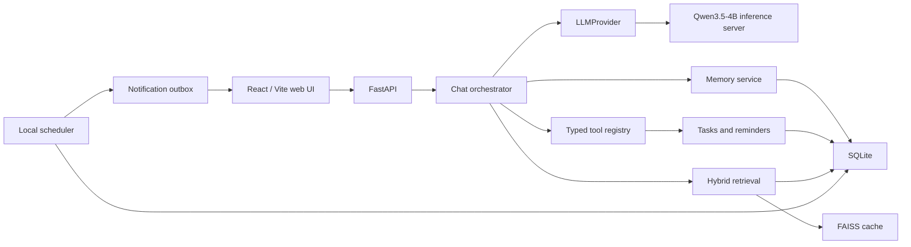
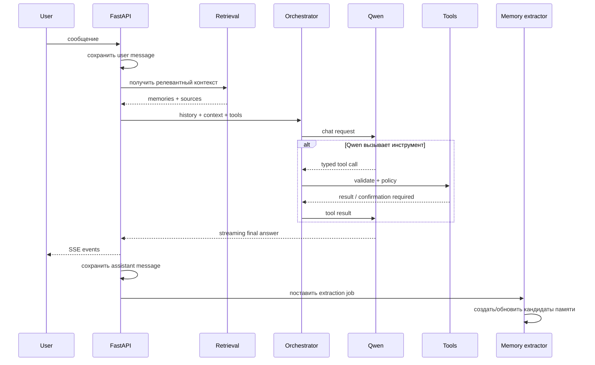

# Second Brain: план реализации локального web-приложения

Статус документа: базовый архитектурный план  
Целевая модель: `Qwen/Qwen3.5-4B`  
Первый формат продукта: локальное web-приложение  
Возможное продолжение: Telegram-бот как дополнительный канал

## 1. Цель продукта

Second Brain — локальный персональный ассистент, который:

- ведёт обычные диалоги;
- сохраняет важные факты, предпочтения, решения и идеи;
- находит ранее сохранённую информацию;
- понимает намерение из обычного текста, не требуя slash-команд;
- превращает сообщения в задачи и напоминания;
- формирует дневные, недельные и месячные обзоры;
- показывает пользователю, что именно было запомнено и почему;
- выполняет только разрешённые действия и ведёт журнал этих действий.

Первый релиз рассчитан на одного локального пользователя. Регистрация, облачная
синхронизация и Telegram не входят в MVP, но архитектура не должна мешать их
последующему добавлению.

## 2. Зафиксированные решения

### 2.1. Интерфейс

- React/Vite остаётся основным интерфейсом.
- FastAPI остаётся backend API.
- Приложение открывается в браузере и работает локально.
- Backend по умолчанию слушает только `127.0.0.1`.
- SQLite остаётся источником истины в локальной версии.
- FAISS можно оставить производным векторным индексом.

### 2.2. Модель

- Основная LLM: `Qwen/Qwen3.5-4B`.
- Модель работает в отдельном inference-процессе.
- FastAPI не загружает веса модели в собственный процесс.
- Backend обращается к inference-сервису через OpenAI-compatible HTTP API.
- Для обычного диалога thinking выключен; для сложных задач включается явно.
- Начальный контекст ограничивается 16K–32K токенов, несмотря на значительно
  больший заявленный контекст модели. Это экономит VRAM и снижает задержку.
- Для первого запуска используется Q4-квантизация, если выбранный inference
  engine корректно поддерживает Qwen3.5 и tool calling.

Официальные ссылки:

- [Qwen3.5-4B model card](https://huggingface.co/Qwen/Qwen3.5-4B)
- [Qwen3.5 в Transformers](https://huggingface.co/docs/transformers/model_doc/qwen3_5)

### 2.3. Inference engine

Выбор engine выполняется отдельным коротким техническим исследованием:

1. Проверить актуальный `llama.cpp/llama-server` и официальный либо проверенный
   GGUF Q4 на Windows.
2. Проверить корректность русского текста, streaming, system prompt, thinking и
   structured output.
3. Проверить вызов инструментов. Если engine не поддерживает нативный parser
   Qwen3.5, использовать контролируемый JSON-формат и валидацию через Pydantic.
4. Если GGUF-путь нестабилен, использовать отдельный Transformers inference
   service. vLLM/SGLang оставить предпочтительным вариантом для будущего Linux-
   сервера и высокой нагрузки.

Приложение не должно зависеть от конкретного engine. Для него существует только
интерфейс `LLMProvider`.

### 2.4. Что сознательно не используется в MVP

- runtime-рой из нескольких агентов;
- LangChain/LlamaIndex только ради абстракции;
- MCP для внутренних операций с памятью и задачами;
- PostgreSQL, Redis и Kubernetes;
- автоматическое выполнение произвольных команд модели;
- загрузка файлов и видео до стабилизации памяти, задач и напоминаний.

## 3. Границы MVP

### Входит

- локальный запуск приложения одной командой;
- несколько чатов и папок;
- потоковые ответы Qwen3.5-4B;
- контролируемая долговременная память;
- просмотр, редактирование и удаление памяти;
- семантический и текстовый поиск;
- задачи;
- разовые локальные напоминания;
- дневной и недельный summary по запросу;
- естественное распознавание намерений;
- slash-команды как точный резервный интерфейс;
- журнал выполненных инструментов;
- экспорт данных.

### Не входит

- регистрация пользователей;
- доступ из интернета;
- синхронизация нескольких устройств;
- почта, календарь и сторонние MCP;
- Telegram;
- автоматическое скачивание медиа;
- голосовые сообщения;
- мобильное нативное приложение;
- полностью автономные действия без правил пользователя.

## 4. Критерии готовности MVP

MVP считается готовым, если:

1. Приложение запускается локально после чистой установки по документированной
   инструкции.
2. Qwen работает отдельным процессом, а перезапуск FastAPI не перезагружает
   модель.
3. Обычная реплика `привет` не становится воспоминанием.
4. Фраза `запомни, что я не ем арахис` создаёт редактируемое воспоминание со
   ссылкой на исходное сообщение.
5. Фраза `завтра напомни отправить отчёт` создаёт задачу и напоминание после
   понятного подтверждения.
6. Удаление исходного сообщения не оставляет скрытую активную память без
   предупреждения.
7. Поиск на русском находит релевантные факты из разных чатов.
8. Пользователь может увидеть, исправить, деактивировать и удалить любую память.
9. Все tool calls валидируются, а разрушительные операции требуют подтверждения.
10. Unit, API, integration и минимальный LLM-eval набор проходят успешно.

## 5. Целевая архитектура



### Ответственность компонентов

| Компонент | Ответственность |
| --- | --- |
| React UI | Чаты, Today, память, задачи, напоминания, подтверждения действий |
| FastAPI | HTTP/SSE API, валидация, сборка сервисов |
| Chat orchestrator | Контекст, цикл tool calling, генерация окончательного ответа |
| LLMProvider | Единый интерфейс к локальному inference API |
| Memory service | Извлечение, нормализация, версии и удаление воспоминаний |
| Retrieval service | FTS + embeddings + фильтры + reranking |
| Tool registry | Разрешённые инструменты и строгие схемы аргументов |
| Policy engine | Решение: выполнить, спросить подтверждение или запретить |
| Scheduler | Поиск наступивших напоминаний и периодических заданий |
| Outbox | Надёжная доставка уведомлений в UI, позднее — в Telegram |

## 6. Структура backend

Переход выполняется постепенно. Не нужно сразу переносить весь существующий код.

```text
app/
  api/
    routes.py                 существующие chat endpoints
    memories.py               API памяти
    tasks.py                  API задач и напоминаний
    settings.py               настройки модели и приложения
  llm/
    base.py                   протокол LLMProvider
    openai_compatible.py      клиент inference-сервиса
    prompts.py                versioned prompts
  agent/
    orchestrator.py           цикл chat -> tools -> final answer
    tool_registry.py          реестр инструментов
    policies.py               подтверждения и ограничения
    schemas.py                Pydantic-схемы tool calls
  memory/
    service.py                бизнес-логика памяти
    extractor.py              извлечение кандидатов из сообщений
    retrieval.py              hybrid search и сборка контекста
    store.py                  SQLite repository
    embeddings.py             embedder и FAISS
  tasks/
    service.py
    store.py
  jobs/
    scheduler.py
    outbox.py
  chat/
    store.py
    commands.py
  db/
    connection.py             единая фабрика подключений
    migrations/               версионированные миграции
  main.py
```

На первом этапе допустимо сохранить текущие файлы и добавлять новые модули рядом.
Перенос нужен только тогда, когда новая ответственность действительно появилась.

## 7. Интерфейс LLMProvider

FastAPI не должен знать о Transformers, GGUF или CUDA.

```python
class LLMProvider(Protocol):
    async def stream_chat(
        self,
        messages: list[ChatMessage],
        *,
        tools: list[ToolDefinition] | None = None,
        thinking: bool = False,
        max_tokens: int = 1024,
    ) -> AsyncIterator[LLMEvent]: ...

    async def complete_json(
        self,
        messages: list[ChatMessage],
        schema: type[BaseModel],
    ) -> BaseModel: ...

    async def health(self) -> ModelHealth: ...
```

Типы `LLMEvent`:

- `text_delta`;
- `tool_call`;
- `thinking_delta`, если UI когда-нибудь будет его показывать;
- `usage`;
- `done`;
- `error`.

Thinking-текст не сохраняется как ответ и не показывается по умолчанию.

### Настройки

```env
LLM_PROVIDER=openai_compatible
LLM_BASE_URL=http://127.0.0.1:8081/v1
LLM_API_KEY=local
LLM_MODEL=Qwen/Qwen3.5-4B
LLM_CONTEXT_TOKENS=16384
LLM_MAX_OUTPUT_TOKENS=1024
LLM_THINKING_DEFAULT=false
APP_HOST=127.0.0.1
APP_PORT=8000
```

Секреты и machine-specific настройки не коммитятся. В репозитории хранится
`.env.example`.

## 8. Модель данных

SQLite остаётся источником истины. FAISS — удаляемый и перестраиваемый кеш.

### 8.1. Workspace

Хотя MVP однопользовательский, во всех новых доменных таблицах следует добавить
`workspace_id`. В локальной версии автоматически создаётся workspace `1`.
Это дешевле, чем позже добавлять изоляцию во все запросы при появлении Telegram
или регистрации.

```text
workspaces
- id
- name
- created_at
```

### 8.2. Messages

Существующая таблица расширяется:

```text
messages
- id
- workspace_id
- chat_id
- role
- content
- created_at
- edited_at
- deleted_at
```

Предпочтительно soft delete, потому что производные сущности могут ссылаться на
сообщение. UI всё равно должен позволять окончательное удаление данных.

### 8.3. Memories

```text
memories
- id
- workspace_id
- kind                 fact | preference | decision | idea | person | project
- content
- normalized_content
- summary
- importance           0.0 .. 1.0
- confidence           0.0 .. 1.0
- sensitivity          normal | private | secret
- source_type          chat | manual | import | summary
- source_message_id    nullable
- status               candidate | active | superseded | deleted
- valid_from            nullable
- valid_to              nullable
- supersedes_id         nullable
- embedding_status      pending | ready | failed
- created_at
- updated_at
- deleted_at
```

Теги можно оставить отдельной связью many-to-many. Не хранить их единственной
JSON-строкой, если по ним нужен поиск.

### 8.4. Tasks и reminders

```text
tasks
- id
- workspace_id
- title
- description
- status               open | done | cancelled
- priority
- due_at                nullable
- source_message_id     nullable
- created_at
- updated_at
- completed_at          nullable

reminders
- id
- workspace_id
- task_id               nullable
- title
- scheduled_at
- timezone
- recurrence_rule       nullable
- status               scheduled | fired | cancelled | failed
- channel               web
- created_at
- fired_at              nullable
```

Все даты хранятся в UTC. Исходная timezone хранится отдельно. Для текущего
пользователя default — `Europe/Moscow`.

### 8.5. Summaries, tool runs и outbox

```text
summaries
- id
- workspace_id
- period_type           day | week | month | custom
- period_start
- period_end
- content
- source_snapshot       JSON со списком использованных id
- created_at

tool_runs
- id
- workspace_id
- chat_id
- message_id
- tool_name
- arguments_json
- result_json
- policy_decision       auto | confirmed | denied
- status               pending | success | failed
- created_at
- finished_at

outbox
- id
- workspace_id
- channel               web, позднее telegram
- event_type
- payload_json
- available_at
- status               pending | sent | failed
- attempts
- last_error
```

## 9. Пайплайн сообщения



Важный порядок: текущая пользовательская реплика не должна сначала безусловно
попадать в память, а затем извлекаться через RAG в том же запросе.

## 10. Память

### 10.1. Два слоя

1. **Журнал:** сообщения и события сохраняются как история взаимодействия.
2. **Курируемая память:** отдельные факты, предпочтения, решения и идеи.

Сообщение не равно воспоминанию.

### 10.2. Извлечение

После сохранения сообщения extractor возвращает строго типизированный результат:

```json
{
  "candidates": [
    {
      "kind": "preference",
      "content": "Пользователь не ест арахис",
      "importance": 0.9,
      "confidence": 0.98,
      "sensitivity": "normal",
      "explicit": true
    }
  ]
}
```

Правила:

- `запомни`, `учти`, `всегда` повышают вероятность сохранения;
- приветствия, уточнения формата и одноразовые команды игнорируются;
- предположения модели сохраняются только как `candidate`;
- чувствительные данные не сохраняются автоматически;
- дубликаты объединяются;
- противоречие создаёт новую версию и помечает старую `superseded`;
- источник всегда сохраняется;
- extractor не выполняет внешние действия.

### 10.3. Удаление и редактирование

- При редактировании исходного сообщения связанные воспоминания помечаются для
  повторного извлечения.
- При удалении сообщения UI спрашивает, удалить ли производные воспоминания.
- Удаление памяти перестраивает/обновляет FAISS.
- Экспорт содержит и активные, и при желании удалённые/заменённые версии.

## 11. Retrieval

Текущий `all-MiniLM-L6-v2` следует заменить или сравнить с multilingual-моделью.
Начальный кандидат — `intfloat/multilingual-e5-small`; альтернативный более
тяжёлый вариант — `BAAI/bge-m3`.

Выбор делается по русскоязычному eval-набору, а не по общему leaderboard.

Hybrid retrieval:

1. SQLite FTS5 ищет точные слова, имена и номера.
2. Embeddings + FAISS находят семантически близкие записи.
3. Результаты объединяются и дедуплицируются.
4. Учитываются status, kind, папка/проект, давность и importance.
5. В prompt попадают только записи в пределах token budget.
6. Вместе с памятью сохраняются source ids для объяснения ответа.

Пример начального score, который затем настраивается по eval:

```text
score = 0.55 * semantic
      + 0.25 * lexical
      + 0.10 * importance
      + 0.10 * recency
```

Не использовать один фиксированный `top_k` для всех запросов. Запрос про дату,
человека или точную цитату требует иной стратегии, чем общий вопрос о проекте.

## 12. Tool calling

### 12.1. Инструменты MVP

```text
memory.create
memory.search
memory.update
memory.delete
task.create
task.list
task.complete
task.cancel
reminder.create
reminder.list
reminder.cancel
summary.create
```

Каждый инструмент имеет:

- уникальное имя;
- Pydantic-схему аргументов;
- Pydantic-схему результата;
- уровень риска;
- timeout;
- idempotency key для операций записи;
- запись в `tool_runs`.

Модель никогда не передаёт Python-код и не выбирает shell-команду.

### 12.2. Policy engine

| Уровень | Примеры | Поведение |
| --- | --- | --- |
| Read | Поиск памяти, список задач | Выполнить автоматически |
| Low write | Явное `запомни`, создать обычную задачу | Выполнить и показать результат |
| Confirm | Напоминание, изменение важных данных | Показать карточку подтверждения |
| Destructive | Удаление, массовое изменение | Всегда явное подтверждение |
| Forbidden | Shell, произвольный URL fetch, изменение файлов | Не предоставлять модели |

Подтверждение — структурированная сущность с `confirmation_id`, а не вопрос,
который модель пытается интерпретировать по следующему сообщению.

## 13. Задачи, scheduler и уведомления

Для локального MVP достаточно одного scheduler-процесса или фонового цикла,
запускаемого вместе с backend. Не нужен Redis.

Требования:

- каждую минуту выбирать due reminders;
- атомарно помечать выбранное напоминание;
- создавать запись outbox;
- показывать уведомление в UI через polling или SSE;
- после перезапуска обработать пропущенные напоминания;
- не отправлять одно напоминание дважды;
- хранить timezone и recurrence rule;
- иметь quiet hours в настройках.

Для системных desktop-уведомлений позже можно добавить отдельный локальный
адаптер. Браузерные уведомления требуют разрешения пользователя и не должны быть
единственным способом доставки.

## 14. Summaries

Summary строится не просто по последним N воспоминаниям, а по временному диапазону:

- сообщения;
- созданные и закрытые задачи;
- решения;
- новые воспоминания;
- активность по проектам.

Структура weekly summary:

1. Главное за неделю.
2. Что завершено.
3. Незавершённые обязательства.
4. Новые решения и факты.
5. Риски и повторяющиеся проблемы.
6. Предлагаемые следующие шаги.

Сначала summary создаётся вручную. Автоматическое расписание добавляется после
проверки качества и возможности отключить его.

## 15. Контекст чата

Нельзя передавать модели всю историю чата без ограничения.

Состав контекста:

```text
system prompt
+ context папки/проекта
+ rolling summary старой истории
+ релевантные memories
+ последние 10–30 сообщений
+ текущий запрос
+ доступные tools
```

Token budget должен быть явным. Пример для 16K:

| Часть | Бюджет |
| --- | ---: |
| System и tools | 2K |
| Rolling summary | 2K |
| Memories | 3K |
| Последние сообщения | 7K |
| Резерв ответа | 2K |

## 16. API

Существующие endpoints сохраняются там, где это возможно.

```text
POST   /api/chat
GET    /api/chats
POST   /api/chats
GET    /api/chats/{id}/messages

GET    /api/memories
GET    /api/memories/{id}
PATCH  /api/memories/{id}
DELETE /api/memories/{id}
POST   /api/memories/{id}/restore

GET    /api/tasks
POST   /api/tasks
PATCH  /api/tasks/{id}
DELETE /api/tasks/{id}

GET    /api/reminders
POST   /api/reminders
PATCH  /api/reminders/{id}
DELETE /api/reminders/{id}

POST   /api/confirmations/{id}/approve
POST   /api/confirmations/{id}/deny

POST   /api/summaries
GET    /api/summaries

GET    /api/settings
PATCH  /api/settings
GET    /api/health
GET    /api/model/health
```

SSE события чата должны иметь явный тип:

```text
event: token
event: tool_started
event: tool_finished
event: confirmation_required
event: memory_created
event: done
event: error
```

## 17. UI

Рекомендуемые разделы:

### Today

- ближайшие напоминания;
- открытые задачи;
- краткая сводка;
- быстрый ввод.

### Chats

- текущие папки и чаты;
- потоковый ответ;
- карточки tool calls;
- источники использованной памяти;
- кнопка `Что было запомнено из этого сообщения`.

### Memory

- фильтры по kind, статусу и тегам;
- поиск;
- source message;
- confidence и importance;
- исправление, деактивация и удаление;
- кандидаты, ожидающие подтверждения.

### Tasks

- open/done/cancelled;
- сроки;
- связанные напоминания;
- источник создания.

### Settings

- состояние inference-сервиса;
- модель и context size;
- thinking default;
- timezone;
- автосохранение памяти;
- quiet hours;
- экспорт и удаление данных.

Slash-команды сохраняются, но не являются главным UX.

## 18. Безопасность локального приложения

- Слушать только `127.0.0.1` по умолчанию.
- Не включать широкий CORS.
- Не принимать пути к файлам от модели.
- Не выполнять shell-команды из tool calls.
- Валидировать каждый tool call через allowlist и Pydantic.
- Ограничить размер входных сообщений и результатов инструментов.
- Экранировать вывод при рендере Markdown.
- Помечать сохранённый внешний контент как недоверенный.
- Не позволять содержимому памяти менять system instructions.
- Вести аудит операций записи и удаления.
- Экспортировать данные локально без скрытой телеметрии.

Если приложение когда-нибудь будет доступно не только на localhost, до этого
обязательно добавить authentication, TLS, CSRF-защиту, rate limiting и изоляцию
workspace.

## 19. Миграции

Текущий helper с `ALTER TABLE` следует заменить на последовательные версии:

```text
schema_migrations
- version
- applied_at
```

Каждая migration:

- имеет номер;
- выполняется в транзакции;
- идемпотентна либо применяется ровно один раз;
- проверяется на копии существующей `brain.db`;
- не удаляет пользовательские данные без отдельного backup.

Перед первой большой миграцией приложение автоматически создаёт timestamped
backup базы.

## 20. Тестирование

### Unit

- repositories;
- memory extraction policy;
- merge/supersede;
- retrieval scoring;
- schemas инструментов;
- policy decisions;
- timezone и recurrence;
- context budget.

### API

- chat streaming;
- CRUD памяти, задач и напоминаний;
- confirmations;
- soft delete;
- export;
- health при выключенной модели.

### Integration

- fake OpenAI-compatible inference server;
- реальный Qwen smoke test отдельным marker;
- restart scheduler без двойных уведомлений;
- rebuild FAISS из SQLite;
- редактирование сообщения и переизвлечение памяти.

### LLM eval

Создать versioned набор минимум из 50 русскоязычных сценариев:

- сохранить явный факт;
- не сохранять пустую реплику;
- извлечь задачу и дату;
- не придумать отсутствующую дату;
- выбрать правильный инструмент;
- выдать валидные аргументы;
- запросить подтверждение;
- найти противоречие;
- сделать summary;
- игнорировать prompt injection в сохранённой странице/памяти.

Метрики:

- precision/recall извлечения памяти;
- точность выбора инструмента;
- валидность JSON;
- доля лишних tool calls;
- качество русского ответа;
- TTFT;
- tokens/sec;
- VRAM;
- время end-to-end.

## 21. Логи и диагностика

Логи структурированные, без полного содержимого приватных сообщений по умолчанию.

Необходимые поля:

- request id;
- chat id;
- model name;
- prompt/output token count;
- latency и TTFT;
- retrieval candidate count;
- tool name/status;
- scheduler job id;
- error category.

`/api/health` должен отдельно показывать:

- backend;
- database;
- inference server;
- embeddings/index;
- scheduler;
- pending outbox.

## 22. Порядок реализации

### Этап 0. Стабилизация текущего проекта

- исправить синтаксический дубль в `frontend/src/App.tsx`;
- восстановить воспроизводимую установку Python и Node dependencies;
- добиться зелёных backend tests и frontend build;
- зафиксировать baseline screenshots;
- добавить `.env.example`.

Результат: текущий прототип воспроизводимо запускается и тестируется.

### Этап 1. Qwen как отдельный сервис

- провести engine spike;
- выбрать Q4 checkpoint;
- запустить OpenAI-compatible endpoint;
- добавить `LLMProvider` и HTTP-клиент;
- удалить загрузку весов из FastAPI;
- проверить streaming, русский, thinking и отмену генерации;
- добавить model health в UI.

Результат: чат работает через Qwen3.5-4B, backend не зависит от engine.

### Этап 2. Версионированная база

- добавить `schema_migrations`;
- добавить local workspace;
- расширить messages;
- создать новые memories, tasks, reminders, tool_runs, summaries и outbox;
- мигрировать существующие записи без потери данных;
- добавить backup перед migration.

Результат: схема поддерживает предметную область и дальнейшее развитие.

### Этап 3. Курируемая память

- прекратить безусловное сохранение каждого сообщения;
- реализовать extractor;
- добавить candidate/active/superseded;
- связать память с сообщениями;
- реализовать Memory UI;
- добавить edit/delete propagation;
- заменить или сравнить embedding model;
- реализовать hybrid retrieval.

Результат: модель запоминает важное, а пользователь контролирует память.

### Этап 4. Orchestrator и инструменты

- реализовать typed registry;
- добавить policy engine;
- добавить tool loop;
- реализовать confirmations;
- добавить tool cards и audit UI;
- перенести slash-команды на те же application services.

Результат: естественный текст и команды используют одну бизнес-логику.

### Этап 5. Задачи и напоминания

- CRUD задач;
- распознавание задач и дат;
- scheduler;
- outbox;
- UI Today/Tasks;
- обработка missed reminders;
- timezone и quiet hours.

Результат: локальные действия и уведомления работают после перезапуска.

### Этап 6. Summaries и управление контекстом

- rolling chat summaries;
- ручной daily/weekly summary;
- period-based selection;
- source snapshot;
- token budget;
- источники воспоминаний в ответах.

Результат: длинные чаты не переполняют контекст, обзоры воспроизводимы.

### Этап 7. Полировка MVP

- полный LLM eval;
- performance profiling;
- export/import;
- резервные копии;
- onboarding;
- документация запуска и восстановления;
- packaged local launcher.

Результат: приложение пригодно для ежедневного личного использования.

## 23. Будущий Telegram

Telegram добавляется как канал, а не как отдельная бизнес-логика.

До его реализации нужно иметь интерфейс:

```python
class ChannelAdapter(Protocol):
    async def receive(self, event: IncomingEvent) -> None: ...
    async def send(self, notification: OutboxMessage) -> DeliveryResult: ...
```

Будущая схема:

```text
Telegram update
    -> TelegramAdapter
    -> тот же ChatOrchestrator
    -> те же Memory/Task/Reminder services
    -> outbox(channel="telegram")
    -> TelegramAdapter.send
```

Потребуется добавить:

- users и identities;
- связь `telegram_user_id -> workspace_id`;
- секрет bot token;
- webhook или long polling;
- rate limits;
- команды согласия на уведомления;
- настройки канала доставки;
- авторизацию web-интерфейса, если он станет удалённым.

Telegram не должен становиться источником истины. История, память, задачи и
настройки остаются в backend.

## 24. Будущие интеграции и media worker

После MVP можно добавить:

- календарь, почту и документы через MCP;
- Telegram;
- обработку файлов;
- транскрипцию аудио;
- `yt-dlp` + `ffmpeg` worker;
- загрузку и summary видео;
- облачный или более сильный LLM fallback.

Media worker должен быть отдельным процессом с лимитами размера, времени,
разрешённых URL и форматов. Модель не получает прямой shell-доступ.

## 25. Основные риски

| Риск | Снижение риска |
| --- | --- |
| Новый engine нестабилен с Qwen3.5 | Engine spike и provider abstraction |
| 262K context вызывает OOM | Начать с 16K, измерять VRAM |
| Модель сохраняет мусор | Candidate state, explicit rules, eval |
| Tool hallucination | Allowlist, schemas, policy, confirmations |
| Память не синхронна с чатами | source_message_id и re-extraction |
| FAISS расходится с SQLite | SQLite source of truth, rebuild command |
| Напоминания дублируются | Atomic claim, outbox, idempotency key |
| Раннее усложнение | Один orchestrator, SQLite, без MCP внутри |
| Слабый русский retrieval | Multilingual embedding eval |
| Потеря локальной базы | Backup перед migrations и экспорт |

## 26. Первые практические задачи

Следующий рабочий пакет должен быть небольшим и проверяемым:

1. Исправить текущую сборку frontend и запустить существующие тесты.
2. Создать `LLMProvider` и fake provider для тестов.
3. Поднять Qwen3.5-4B отдельным процессом.
4. Переключить `/api/chat` с прямого `GemmaLLM` на provider.
5. Добавить smoke-тест русского streaming-ответа.
6. Зафиксировать latency, tokens/sec и VRAM.

До выполнения этого пакета не следует одновременно переписывать память, UI и
базу: иначе будет сложно отделить проблемы модели от проблем новой архитектуры.

